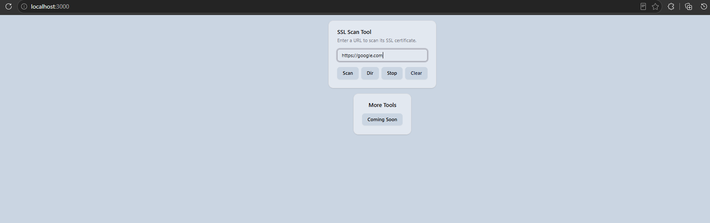
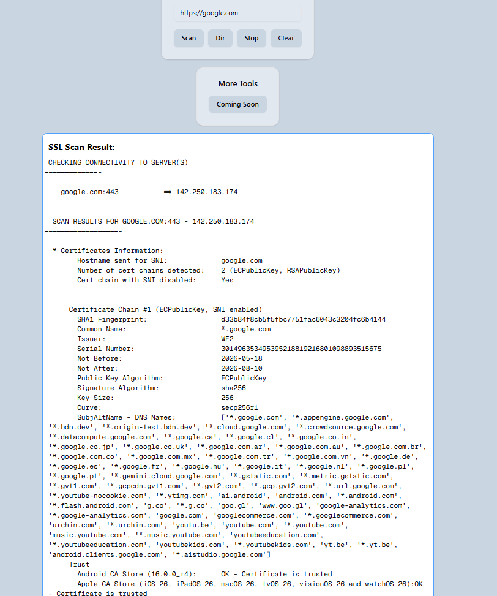
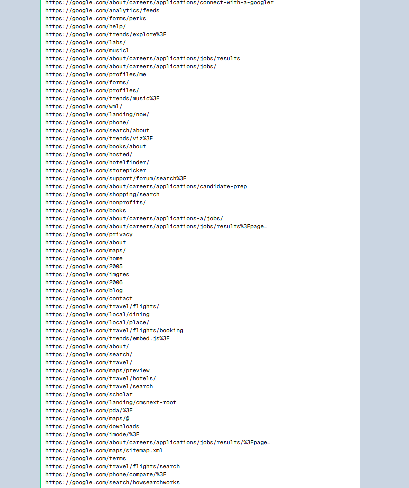
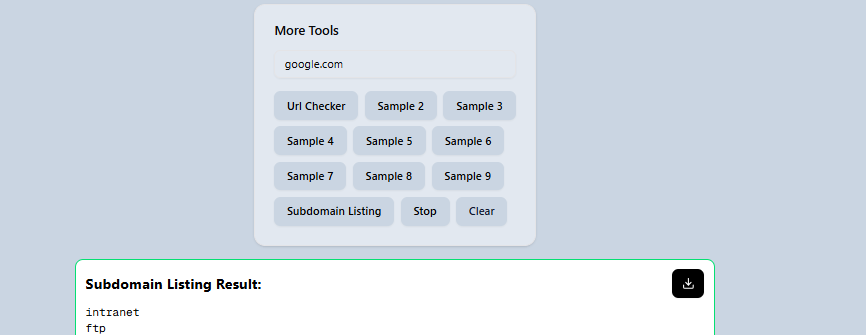

# TITAN

A modern web-based security reconnaissance and assessment platform built with **React** and **FastAPI**.

TITAN provides an easy-to-use interface for performing:

* SSL/TLS Security Analysis
* URL Reachability Validation
* Directory & Endpoint Discovery
* Subdomain Enumeration
* Real-time Scan Streaming
* Security Reconnaissance Automation

---

## 🚀 Features

### 🔒 SSL Scanner

Analyze SSL/TLS configurations and identify security issues using SSLyze.

### 🌐 URL Validator

Verify whether a target URL is reachable and valid before initiating scans.

### 📂 Directory Discovery

Perform directory and endpoint enumeration using Feroxbuster with real-time output streaming.

### 🌍 Subdomain Enumeration

Discover subdomains using FFUF and custom wordlists.

### ⚡ Real-Time Results

Receive scan output instantly through Server-Sent Events (SSE).

### 🖥️ Modern UI

Responsive React frontend with an intuitive user experience.

---

## 🏗️ Architecture

```text
┌──────────────┐
│ React Client │
└──────┬───────┘
       │ HTTP API
       ▼
┌──────────────┐
│ FastAPI API  │
└──────┬───────┘
       │
       ├── SSLyze
       ├── Feroxbuster
       └── FFUF
```

---

## 📁 Project Structure

```text
TITAN/
│
├── client/                 # React Frontend
│
├── server/
│   ├── app.py              # FastAPI Backend
│   ├── resources/
│   │   ├── feroxbuster.exe
│   │   ├── ffuf.exe
│   │   ├── fuzz.txt
│   │   ├── fuzz2.txt
│   │   └── command_text.txt
│   │
│   └── req.txt
│
└── README.md
```

---

## ⚙️ Backend Setup

### Create Virtual Environment

```bash
python -m venv venv
```

### Activate Environment

Windows:

```bash
venv\Scripts\activate
```

Linux / Mac:

```bash
source venv/bin/activate
```

### Install Dependencies

```bash
pip install -r req.txt
```

### Run FastAPI Server

```bash
uvicorn app:app --reload
```

Backend will start at:

```text
http://localhost:8000
```

---

## 🎨 Frontend Setup

Navigate to the client directory:

```bash
cd client
```

Install dependencies:

```bash
npm install
```

Run development server:

```bash
npm run dev
```

Frontend will start at:

```text
http://localhost:5173
```

---

## 🔌 API Endpoints

### SSL Scan

```http
POST /sslscan
```

### URL Validation

```http
GET /url-checker
```

### Directory Enumeration

```http
GET /mhunt
```

### Subdomain Enumeration

```http
GET /subdomain-listing
```

### Stop Running Scan

```http
GET /stop_scan
```

---

## 🎥 Demo Video

### Project Walkthrough

[](./demo/demo.mp4)

Or directly:

👉 YOUR_VIDEO_LINK_HERE

---

## 📸 Screenshots

### Dashboard



### SSL Scan



### Directory Enumeration



### Subdomain Enumeration



---

## 🛠️ Technologies Used

### Frontend

* React
* JavaScript
* HTML5
* CSS3

### Backend

* FastAPI
* Python
* Uvicorn
* AsyncIO

### Security Tools

* SSLyze
* Feroxbuster
* FFUF

---

## ⚠️ Disclaimer

This project is intended for educational purposes, security research, and authorized security assessments only.

Always obtain proper authorization before scanning any system.

---

## 📄 License

MIT License

---

## 👨‍💻 Author

Rajesh Avadootha

GitHub:
https://github.com/avadootharajesh
